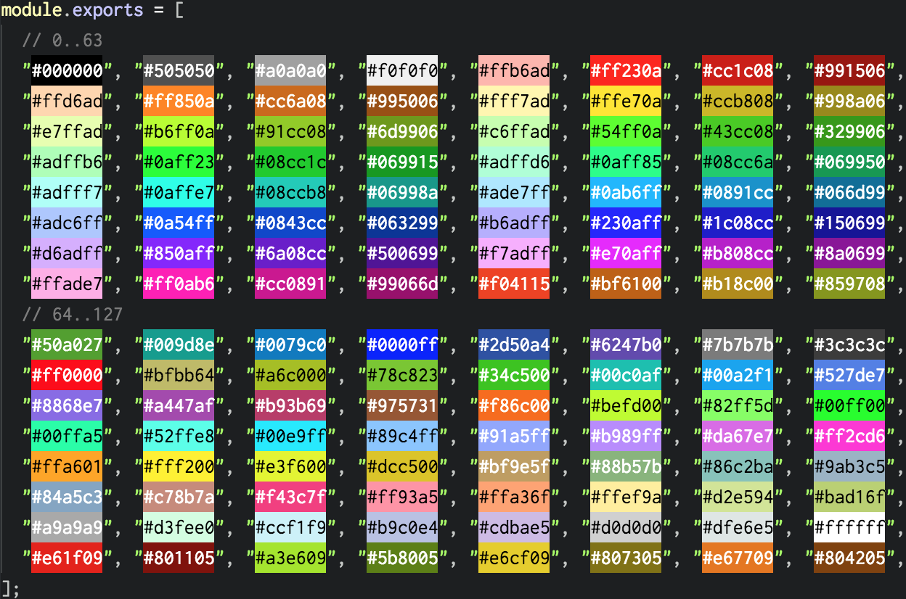

# launch-pad-color
[](https://www.npmjs.org/package/launch-pad-color)
[](http://mohayonao.mit-license.org/)

> color code of Novation LaunchPad

## Installation

```
npm install --save launch-pad-color
```

## Preview



## Update!!

The set of color code has been extracted from photos with sloppy program.
I'm dissatisfied with this.
If you can replace to more better set (by manually or automatically), please pull-request.

| index   | how pick color            |
|:-------:|---------------------------|
|   0- 59 | photo                     |
|  60-119 | capture from Ableton Live |
| 120-127 | photo                     |

## License

MIT
